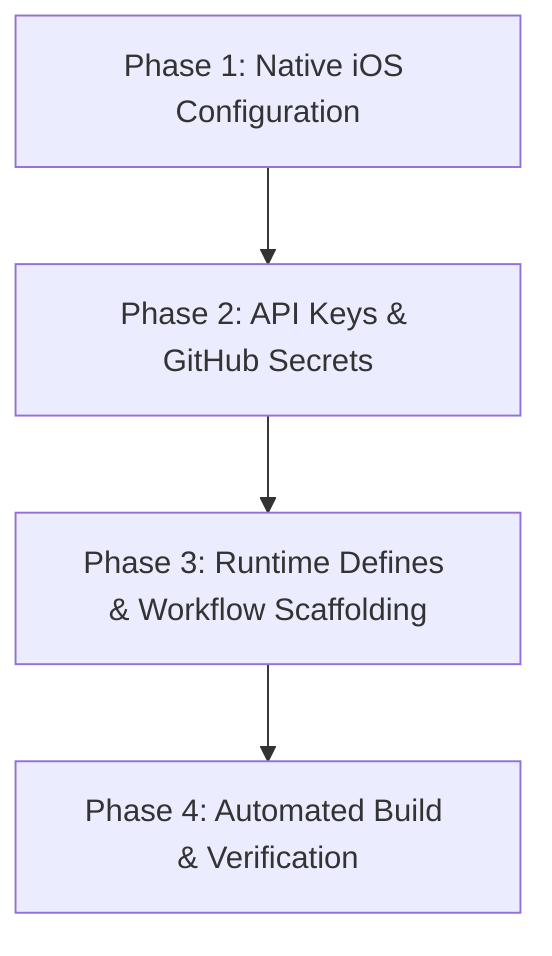

# Flutter iOS CI/CD & TestFlight Deployment Guide: Agent Execution Protocol

> [!IMPORTANT]
> **Operational Purpose & Intended Use:**
> This document is an operational, step-by-step execution protocol for an **AI Agent** (or human developer) to inspect, configure, and automate Flutter iOS release builds, code signing, and App Store Connect / TestFlight deployments via GitHub Actions. It enables complete end-to-end iOS distribution from any development environment (Windows, Linux, or macOS) without requiring local macOS hardware or local Xcode installations.

---

## 🏗️ Architecture & Pipeline Overview

iOS compilation and packaging require Apple SDK toolchains (`xcodebuild`, `altool`/`notarytool`, CocoaPods), which are executed in the cloud on GitHub Actions macOS runners (`macos-latest`). Headless code signing and App Store authentication are performed via Apple's **App Store Connect API Keys (`.p8`)**.

```
+------------------------------------+
|  Development Environment           |
|  (Windows / Linux / macOS)         |
|  - No local Xcode required         |
|  - Push commit or trigger dispatch |
+-----------------+------------------+
                  |
                  | git push / workflow_dispatch
                  v
+-----------------+----------------------------------------------------+
|  GitHub Actions Cloud Pipeline (`macos-latest` Runner)              |
|                                                                      |
|  1. Setup Tooling (Java 17, Flutter Stable, CocoaPods)              |
|  2. Decode & Register App Store Connect API Key (~/.appstoreconnect) |
|  3. Dynamic Replacement of `YOUR_TEAM_ID` in Config Files           |
|  4. Build Release Archive (`flutter build ipa --no-codesign`)        |
|  5. Export & Sign IPA with Automatic Provisioning (`xcodebuild`)    |
|  6. Upload Binary to TestFlight / App Store (`xcrun altool`)        |
+-----------------+----------------------------------------------------+
                  |
                  | authenticated upload via API Key
                  v
+-----------------+------------------------------------+
|  Apple App Store Connect / TestFlight                |
|  - Automated Encryption Compliance Bypass            |
|  - Available for Internal / External Beta Testers    |
+------------------------------------------------------+
```

---

## 📋 Structured Agent Execution Protocol

Follow the four phases below in sequence to audit, configure, scaffold, and deploy the application.



---

## Phase 1: Native iOS Project Configuration

In this phase, the agent must inspect and update the native iOS project files under `ios/` to support headless builds, export compliance, and status bar rendering.

### Step 1.1: `ios/Runner/Info.plist` Configuration

Inspect `ios/Runner/Info.plist` and ensure the following keys are present inside the root `<dict>` block:

```xml
<!-- 1. TestFlight Non-Exempt Encryption Compliance -->
<key>ITSAppUsesNonExemptEncryption</key>
<false/>

<!-- 2. iOS Status Bar Appearance & Visibility -->
<key>UIStatusBarHidden</key>
<false/>
<key>UIViewControllerBasedStatusBarAppearance</key>
<true/>
```

> [!NOTE]
> **Technical Deep-Dive: Status Bar Rendering & Brightness on iOS:**
> * **Prevent Invisible Icons:** Setting `<key>UIStatusBarHidden</key><false/>` ensures the status bar remains visible upon launch.
> * **Dynamic Flutter Control:** Setting `<key>UIViewControllerBasedStatusBarAppearance</key><true/>` delegates status bar style management to Flutter's `SystemUiOverlayStyle` and `AnnotatedRegion` widgets.
> * **Flutter's Inverted Brightness Logic on iOS:**
>   * `statusBarBrightness: Brightness.dark` informs iOS that the background behind the status bar is **dark**, causing iOS to render **white/light text and icons**.
>   * `statusBarBrightness: Brightness.light` informs iOS that the background behind the status bar is **light**, causing iOS to render **black/dark text and icons**.
> * **Export Compliance:** Setting `ITSAppUsesNonExemptEncryption` to `<false/>` bypasses the manual export compliance prompt in App Store Connect, allowing newly uploaded builds to become immediately available for TestFlight testers without human intervention.

---

### Step 1.2: `ios/ExportOptions.plist` Creation

Create or verify the file `ios/ExportOptions.plist`. This file instructs `xcodebuild -exportArchive` to automatically generate and sign the distribution IPA using your Apple Developer Team ID.

```xml
<?xml version="1.0" encoding="UTF-8"?>
<!DOCTYPE plist PUBLIC "-//Apple//DTD PLIST 1.0//EN" "http://www.apple.com/DTDs/PropertyList-1.0.dtd">
<plist version="1.0">
<dict>
	<key>destination</key>
	<string>export</string>
	<key>method</key>
	<string>app-store</string>
	<key>signingStyle</key>
	<string>automatic</string>
	<key>teamID</key>
	<string>YOUR_TEAM_ID</string>
	<key>uploadSymbols</key>
	<true/>
	<key>uploadBitcode</key>
	<false/>
	<key>manageAppVersionAndBuildNumber</key>
	<true/>
</dict>
</plist>
```

> [!TIP]
> Keep `YOUR_TEAM_ID` as the exact literal placeholder string in source control. The CI pipeline will dynamically substitute this value at runtime with `${{ secrets.APPLE_TEAM_ID }}`.

---

### Step 1.3: `ios/Runner.xcodeproj/project.pbxproj` Configuration

The Xcode project file must be configured for automatic provisioning and team assignment.

1. **Target Attributes (`PBXProject` Section):**
   Locate `/* Begin PBXProject section */` -> `TargetAttributes` -> Target `Runner` (typically ID `97C146ED1CF9000F007C117D`):
   ```pbxproj
   TargetAttributes = {
       97C146ED1CF9000F007C117D = {
           CreatedOnToolsVersion = 7.3.1;
           DevelopmentTeam = "YOUR_TEAM_ID";
           LastSwiftMigration = 1100;
           ProvisioningStyle = Automatic;
       };
   };
   ```

2. **Build Configurations (`XCBuildConfiguration` Section):**
   Ensure all configurations (`Debug`, `Release`, `Profile`) for the `Runner` target include:
   ```pbxproj
   DEVELOPMENT_TEAM = "YOUR_TEAM_ID";
   PRODUCT_BUNDLE_IDENTIFIER = com.example.app;
   ```
   *(Replace `com.example.app` with your target bundle identifier `<YOUR_BUNDLE_ID>`)*.

---

## Phase 2: App Store Connect API Key & GitHub Secrets

### Step 2.1: Generate App Store Connect API Key [INSTRUCT USER TO DO THIS]
1. Log in to [Apple App Store Connect](https://appstoreconnect.apple.com/).
2. Navigate to **Users and Access** -> **Integrations** -> **App Store Connect API**.
3. Generate a new API Key with the **App Manager** or **Admin** role.
4. Record:
   * **Key ID** (10-character alphanumeric string, e.g., `2X9R497874`)
   * **Issuer ID** (UUID format, e.g., `69a6de70-0387-47e3-e053-5b8c7c11a4d1`)
   * Download the `.p8` private key file (e.g., `AuthKey_2X9R497874.p8`). *Note: This file can only be downloaded once.*

### Step 2.2: Encode the Private Key to Base64
Encode the `.p8` file to a single Base64 string to store as a GitHub secret:

* **Windows (PowerShell / Command Prompt):**
  ```cmd
  certutil -encode AuthKey_<KEY_ID>.p8 key.b64
  ```
  *(Open `key.b64` and copy the base64 content, excluding the `-----BEGIN CERTIFICATE-----` and `-----END CERTIFICATE-----` wrapper markers if present, or encode via PowerShell:)*
  ```powershell
  [Convert]::ToBase64String([IO.File]::ReadAllBytes("AuthKey_<KEY_ID>.p8")) | Set-Clipboard
  ```

* **macOS / Linux:**
  ```bash
  base64 -i AuthKey_<KEY_ID>.p8 | pbcopy # macOS
  base64 -w 0 AuthKey_<KEY_ID>.p8        # Linux
  ```

---

### Step 2.3: Two-Tier GitHub Secrets Architecture

In the GitHub Repository [INSTRUCT USER TO DO THIS] (**Settings** -> **Secrets and variables** -> **Actions** -> **New repository secret**), configure secrets across the two tiers:

```
+-----------------------------------------------------------------------------------------+
|                               GITHUB SECRETS ARCHITECTURE                               |
+-----------------------------------------------------------------------------------------+
|                                                                                         |
|  [ TIER 1: Core Apple Deployment Secrets (Universal) ]                                  |
|  - APPLE_TEAM_ID                   : 10-char Apple Developer Team ID                    |
|  - APP_STORE_CONNECT_KEY_ID        : 10-char API Key ID                                 |
|  - APP_STORE_CONNECT_ISSUER_ID     : UUID Issuer ID                                     |
|  - APP_STORE_CONNECT_PRIVATE_KEY   : Base64-encoded .p8 file content                    |
|                                                                                         |
|  [ TIER 2: Project-Specific Environment Secrets (Dynamic Discovery) ]                  |
|  - Discovered from target codebase (e.g. .env.example, config classes, lib/env.dart)   |
|  - Injected via --dart-define during build                                              |
|  - Examples: BACKEND_URL, API_KEY, SENTRY_DSN, REVENUECAT_KEY                           |
|                                                                                         |
+-----------------------------------------------------------------------------------------+
```

#### Tier 1: Core Apple Deployment Secrets (Universal)

| Secret Name | Description / Format | Example Value |
| :--- | :--- | :--- |
| `APPLE_TEAM_ID` | 10-character Apple Developer Team ID | `ABC123XYZ9` |
| `APP_STORE_CONNECT_KEY_ID` | 10-character App Store Connect API Key ID | `2X9R497874` |
| `APP_STORE_CONNECT_ISSUER_ID` | App Store Connect Issuer ID (UUID) | `69a6de70-0387-47e3-e053-5b8c7c11a4d1` |
| `APP_STORE_CONNECT_PRIVATE_KEY` | Base64-encoded content of the `.p8` private key | `LS0tLS1CRUdJTi...` |

#### Tier 2: Project-Specific Environment Secrets (Dynamic Discovery)

> [!IMPORTANT]
> **Agent Discovery Protocol for Tier 2 Secrets:**
> When executing against a target repository, the AI Agent must perform the following inspection steps:
> 1. Scan the repository for `.env.example`, `.env.template`, `lib/core/config/`, `lib/env.dart`, `lib/constants.dart`, or classes using `String.fromEnvironment(...)` / `const bool.fromEnvironment(...)`.
> 2. Identify all runtime environment variables required by the application (e.g., `BASE_URL`, `API_KEY`, `PUBLIC_CLIENT_ID`).
> 3. Document the list of discovered variables in the deployment execution summary.
> 4. Add corresponding repository secrets in GitHub Actions and map each to a `--dart-define` argument in the build step.

---

## Phase 3: Dynamic Runtime Defines & Workflow Scaffolding

### Step 3.1: Environment Variable Strategy & Asset Hygiene

* **Standard Practice (`--dart-define`):** Runtime variables and API credentials must be compiled into the binary using `--dart-define` or `--dart-define-from-file`.
* **Security & Clean Packaging:** Environment files (`.env`, `.env.production`) should **never** be included in `pubspec.yaml` under `flutter: assets:`, as this bundles raw secrets into the distributed application package.
* **Legacy Codebase Fallback:** If an older codebase strictly requires a `.env` file because `pubspec.yaml` still references it as an asset, include a fallback `touch .env` step in the workflow to prevent build failure while transitioning to `--dart-define`.

---

### Step 3.2: GitHub Actions Workflow Reference (`.github/workflows/ios_build.yml`)

Create the workflow file at `.github/workflows/ios_build.yml`:

```yaml
name: iOS Build & TestFlight Deployment

on:
  push:
    branches: [ main, master ]
  workflow_dispatch:

jobs:
  build-and-deploy-ios:
    name: Build & Deploy iOS IPA
    runs-on: macos-latest 
    steps:
      - name: Checkout Code Repository
        uses: actions/checkout@v4

      - name: Set up Java Tooling
        uses: actions/setup-java@v4
        with:
          distribution: 'temurin'
          java-version: '17'

      - name: Set up Flutter Environment
        uses: subosito/flutter-action@v2
        with:
          channel: 'stable'
          cache: true

      - name: Install Flutter Dependencies
        run: flutter pub get

      - name: Install CocoaPods Dependencies
        run: |
          cd ios
          pod install
          cd ..

      - name: Configure App Store Connect API Private Key
        run: |
          mkdir -p ~/.appstoreconnect/private_keys
          echo "${{ secrets.APP_STORE_CONNECT_PRIVATE_KEY }}" | base64 --decode > ~/.appstoreconnect/private_keys/AuthKey_${{ secrets.APP_STORE_CONNECT_KEY_ID }}.p8

      - name: Inject Apple Team ID into Project Configurations
        run: |
          sed -i '' "s/YOUR_TEAM_ID/${{ secrets.APPLE_TEAM_ID }}/g" ios/ExportOptions.plist
          sed -i '' "s/YOUR_TEAM_ID/${{ secrets.APPLE_TEAM_ID }}/g" ios/Runner.xcodeproj/project.pbxproj

      # Legacy Fallback: Only necessary if pubspec.yaml declares .env under flutter: assets:
      - name: Legacy .env File Fallback
        run: |
          if grep -q "\.env" pubspec.yaml; then
            echo "Legacy asset reference detected. Creating dummy .env..."
            touch .env
          fi

      - name: Build Flutter iOS Release Archive (IPA)
        run: |
          flutter build ipa --release --no-codesign \
            --build-number=${{ github.run_number }} \
            --dart-define=ENVIRONMENT=production \
            --dart-define=APP_NAME="<APP_NAME>"
            # Dynamically append discovered Tier 2 secrets here:
            # --dart-define=API_URL="${{ secrets.API_URL }}" \
            # --dart-define=API_KEY="${{ secrets.API_KEY }}"

      - name: Export and Sign IPA Archive
        run: |
          xcodebuild -exportArchive \
            -archivePath build/ios/archive/Runner.xcarchive \
            -exportPath build/ios/ipa \
            -exportOptionsPlist ios/ExportOptions.plist \
            -allowProvisioningUpdates \
            -authenticationKeyID "${{ secrets.APP_STORE_CONNECT_KEY_ID }}" \
            -authenticationKeyIssuerID "${{ secrets.APP_STORE_CONNECT_ISSUER_ID }}" \
            -authenticationKeyPath "$HOME/.appstoreconnect/private_keys/AuthKey_${{ secrets.APP_STORE_CONNECT_KEY_ID }}.p8"

      - name: Upload IPA to TestFlight / App Store Connect
        run: |
          xcrun altool --upload-app \
            --type ios \
            --file build/ios/ipa/*.ipa \
            --apiKey "${{ secrets.APP_STORE_CONNECT_KEY_ID }}" \
            --apiIssuer "${{ secrets.APP_STORE_CONNECT_ISSUER_ID }}"

      - name: Upload Build Artifacts
        uses: actions/upload-artifact@v4
        with:
          name: release-ipa
          path: build/ios/ipa/*.ipa
          retention-days: 14
```

> [!TIP]
> **Artifact Retention & Device-Less Online Simulator Testing:**
> * **Artifact Archiving (`actions/upload-artifact`):** Saving the generated `.ipa` file as a GitHub Actions workflow artifact is retained in the pipeline to support browser testing, local archiving, and direct downloads alongside TestFlight distribution.
> * **Testing on Physical Hardware:** If the developer owns a physical iPhone, builds uploaded via `altool` can be tested immediately and natively through **Apple TestFlight**.
> * **Testing without an iPhone (Browser Simulator via [Appetize.io](https://appetize.io/)):** If the developer does **not** own a physical iPhone, downloading the preserved `.ipa` artifact enables them to run, inspect, and test the app in a web browser using cloud-streamed iOS simulator platforms such as **[Appetize.io](https://appetize.io/)** (which provides free trial minutes).
> * **Agent Advisory Instruction (Locating the `.ipa` in GitHub Actions):** The AI Agent should instruct the user on how to locate and download the compiled `.ipa` file after a build:
>   1. Open the GitHub repository in a browser and navigate to the **Actions** tab.
>   2. Select the latest successful run of the **iOS Build & TestFlight Deployment** workflow.
>   3. Scroll to the bottom of the workflow **Summary** page to the **Artifacts** section.
>   4. Click on **`release-ipa`** to download the zip file containing the signed `.ipa` package.

---

## Phase 4: Automated Execution, Versioning & Verification

### Step 4.1: Automated Versioning Strategy
Apple requires every binary submitted to App Store Connect / TestFlight to contain a strictly increasing build number (`CFBundleVersion`). 

* The workflow supplies `--build-number=${{ github.run_number }}` during `flutter build ipa`.
* Since `github.run_number` increments monotonically on every workflow run, collisions are prevented automatically across all CI builds.
* Semantic versioning (`CFBundleShortVersionString`, e.g., `1.0.0`) remains managed via the `version` field in `pubspec.yaml` (e.g., `version: 1.0.0+1`).

---

### Step 4.2: Pre-Flight Agent Verification Checklist

Before triggering or certifying a deployment, the AI Agent must verify the following items:

- [ ] **`ios/Runner/Info.plist`**:
  - `UIStatusBarHidden` is `<false/>`
  - `UIViewControllerBasedStatusBarAppearance` is `<true/>`
  - `ITSAppUsesNonExemptEncryption` is `<false/>`
- [ ] **`ios/ExportOptions.plist`**: File exists, contains `YOUR_TEAM_ID`, `signingStyle = automatic`, `method = app-store`.
- [ ] **`ios/Runner.xcodeproj/project.pbxproj`**: Target `Runner` has `ProvisioningStyle = Automatic;` and `DevelopmentTeam = "YOUR_TEAM_ID";`.
- [ ] **GitHub Secrets (Tier 1)**: `APPLE_TEAM_ID`, `APP_STORE_CONNECT_KEY_ID`, `APP_STORE_CONNECT_ISSUER_ID`, `APP_STORE_CONNECT_PRIVATE_KEY` configured in repository.
- [ ] **GitHub Secrets (Tier 2)**: All required runtime variables discovered and wired into `--dart-define`.
- [ ] **Workflow File**: `.github/workflows/ios_build.yml` matches target build specifications.

---

### Step 4.3: Post-Upload Verification on TestFlight

Once the GitHub Actions workflow completes successfully:
1. Navigate to **App Store Connect** -> **Apps** -> **[Your App]** -> **TestFlight**.
2. The uploaded build will transition through:
   * **Processing** (~5 to 15 minutes while Apple validates symbols and scans binary).
   * **Ready to Test** (Appears automatically without encryption prompts due to `ITSAppUsesNonExemptEncryption`).
3. Testers enrolled in internal or external groups receive an update notification via the TestFlight app.

---

## 🛠️ Troubleshooting & Diagnostic Guide

| Failure / Error Message | Root Cause | Resolution |
| :--- | :--- | :--- |
| `Error: No file or variants found for asset: .env` | `pubspec.yaml` lists `.env` under `flutter: assets:` but file is git-ignored. | Migrate runtime variables to `--dart-define` and remove `.env` from `assets:`. Use the legacy fallback `touch .env` step if immediate cleanup is not feasible. |
| `Status bar icons invisible / blank on iOS` | Inverted brightness logic or missing view controller appearance flag in `Info.plist`. | Set `UIViewControllerBasedStatusBarAppearance` to `<true/>` in `Info.plist`. Ensure dark backgrounds pair with `statusBarBrightness: Brightness.dark` (white icons) and light backgrounds pair with `Brightness.light` (dark icons). |
| `Export failed: No profiles for 'com.example.app' were found` | Bundle ID not registered on Apple Developer Portal or API Key lacks permissions. | Ensure the App ID is created under Apple Developer Portal and that the App Store Connect API Key has **App Manager** or **Admin** privileges. |
| `altool: Unable to upload archive (Authentication failed)` | Corrupted `.p8` key or incorrect `APP_STORE_CONNECT_KEY_ID` / `APP_STORE_CONNECT_ISSUER_ID`. | Verify Base64 decoding of `APP_STORE_CONNECT_PRIVATE_KEY`. Ensure Key ID matches the filename `AuthKey_<KEY_ID>.p8` exactly. |
| `Redundant Binary Upload / Build number already exists` | Build number (`CFBundleVersion`) identical to previous upload. | Verify `--build-number=${{ github.run_number }}` is included in the `flutter build ipa` command. |
